# Introduction 
The dataset is from [Mini Challenge 2](https://vast-challenge.github.io/2021/MC2.html). The whole dataset contains two parts. One is geospatial data, which includes the information of building map. The other is the statistics data, including car assignment data, credit card data, loyalty card data and gps data.

The analysis is going to be performed in two sections:

1. Exploratory Data Analysis (EDA)

2. Geographical Map Visualization (GMV)

# Objective and Motivation of the application
To better identify which GASTech employees made which purchases and identify suspicious patterns of behavior, it is important to fully use the available data to find the abnormality and uncertainty. 

Geospatial analysis has developed a lot in recent years. Data visualization using geographical mapping methods can bring extra relationships and insights than traditional visualization methods. With combining exploratory data analysis and map visualization, our goal is to find the relationships with each ID and the relationship between ID and payment card. By finding out the relationships and linkage, we can find the suspicion and abnormality of ID. 

The interesting background story of the case. Availability of GPS tracking dataset which does not often found in visual analytics cases. The attractiveness of performing geospatial analysis apart from traditional analytics. Geospatial analysis has developed a lot in recent years. Data visualization using geographical mapping methods can bring extra relationships and insights than traditional visualization methods. Opportunities to provide interactive analytics tools that allow users to investigate the case without understanding programming.

# Literature Review

## Previous project
This mini challenge was released in 2014 as well. With go through the previous projects in previous years, we found that using timestamp is important when finding the function of places and the purpose to go to the location. This also helps us in doing the following data preparation.

## R packages installation

Packages and descriptions

1. tidyverse  
Description: Used in data wrangling techniques 
2. dplyr     
Description: Provided operaters/functions for data wrangling techniques 
3. ggplot2   
Description: Basic package in plotting various types of graphs 
4. plotly    
Description: To create interactive graphical visuals 
5. lubridate  
Description: To convert and deal with unstructured datetime 
6. DT        
Description: To provide interactive data tables 
7. sf        
Description: Loading of Geospatial shapefiles

# Design Framework

To build the shiny app as well as perform the interactive visualization of our outputs, we did some data cleaning and data transformation to better plotting the results.

## Data preparation

* In the loyalty card dataset, since some payment might not use loyalty card to record, the price will automatically go to another column. Therefore, we need to put them back to the correct column.

* Variable timestamp in loyalty card dataset and credit card dataset is character type, therefore, datatype of variable timestamp is changed from character to date-time format.

* In loyalty card dataset and credit card dataset, variables “day” “hour” “minute” are extracted from the variable timestamp for the following filtering.

* In order to find out the popular locations, we need to the calculate the number of records of locations and then choose those with more records. Popular locations are explored for credit cards and loyalty cards separately.

* In the gps dataset, to find out all stop points of the cars, a new variable called “time interval” is created to calculate the time interval between any two continuous data.

## Exploratory Data Analysis

Our application uses EDA analysis with interactive features. We use some reactive diagrams to show the basic characteristics and connections of data. This part of the analysis can also help us find some suspicious times and places.

### Ridge Plot

Many locations have appeared in the credit card consumer transaction data. Most of these locations are marked on the map and the categories of locations can be determined by the names of the locations. However, there are still some locations where it is difficult to determine the location category by name and vector icon on the map. Such a situation will affect the subsequent judgment of the whole case. Considering the different distribution characteristics of peak time of human flow in different categories of locations, we can compare the distribution map of peak time of unknown location with the image of known category, and thus figure out the classification of unknown locations.

The Ridge Plot was used here to show the daily visiting frequency distribution of each location. The locations can be divided into 5 categories: restaurant, coffee shop, company, public places, and shops. For examples, coffee shops can be generally divided into two sub-categories. The peak hours of Brew’ve Been Served, Coffee Camelon, and Hallowed Grounds are in the morning, while Bean There Done That, Coffee Shack, and Jack’s Magical Beans are in the afternoon.

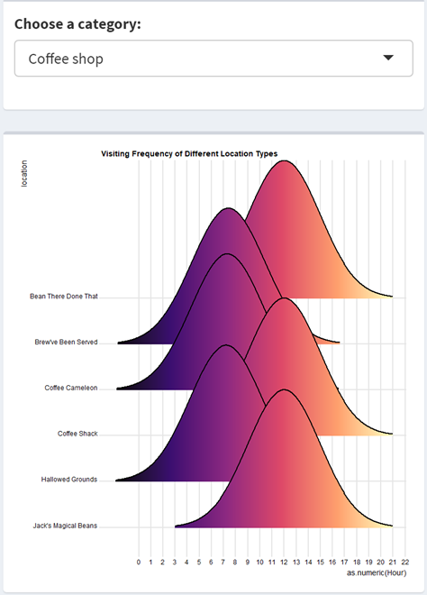

Next, we can compare the images of the unknown locations with images of each of the five known categories separately. By comparison, we can get the possible results.
For example, peak hours of location Hippokampos are quite similar to the peak hours of restaurants. The restaurant usually has two peak hours a day, from 12 to 14 noon and from 19 to 21 p.m. From the image comparison, we can know that the Hippokampos should be a restaurant. 

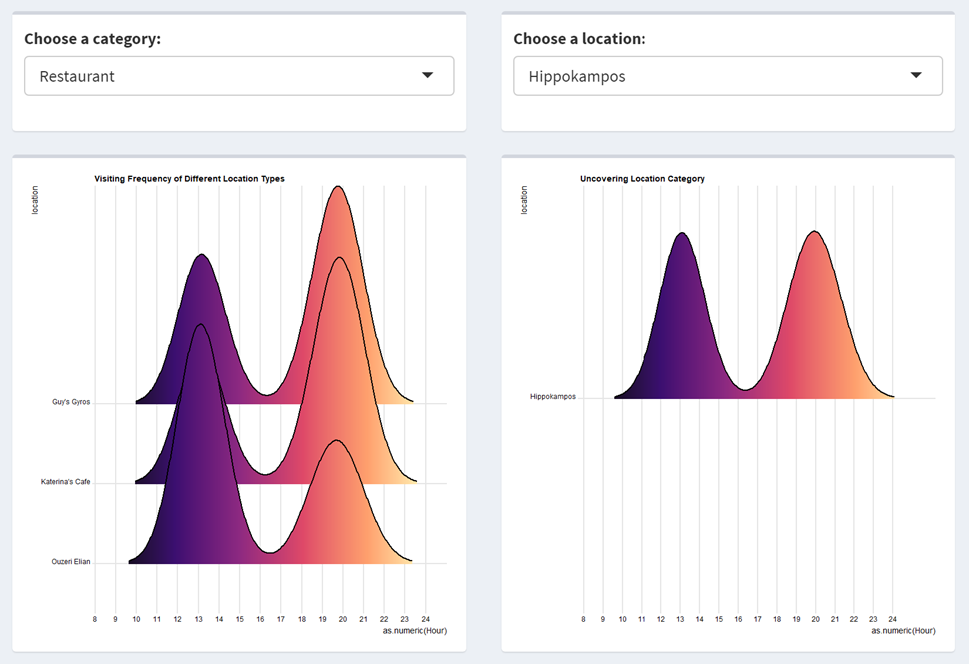

Another example is Kronos Pipe and Irrigation. According to the graph of company category, the working hours are generally longer than other types of locations. The peak hours of such locations are 8 am to 10 am and 15 to 17pm, which are quite similar to the peak hours of Kronos Pipe and Irrigation. Therefore, this point should be categorized as company.

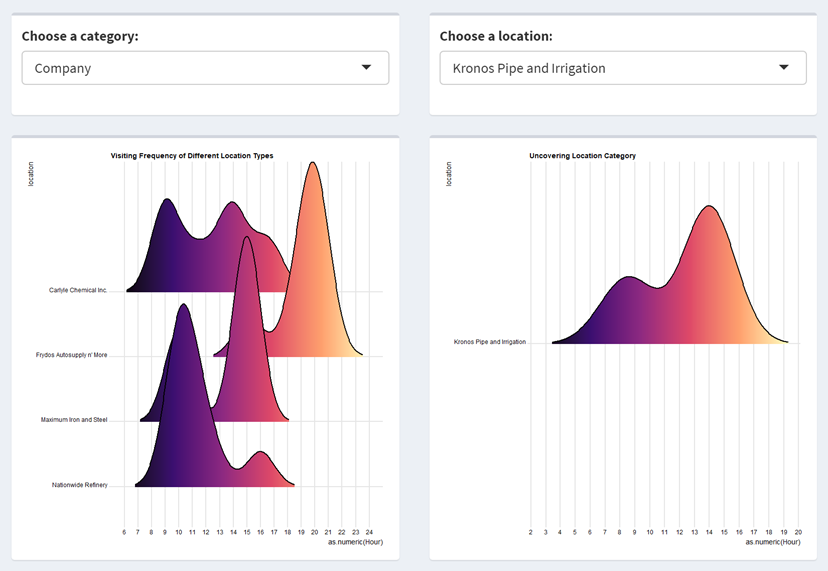

The peak hours of public places are mostly focus on 12 pm to 13 pm. According to this principle, the Kalami Kafenion should be considered as a public place.

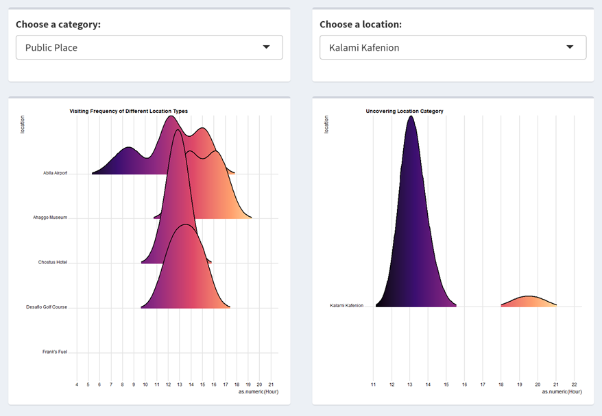

### Bar Chart

In order to explore the overall visiting frequency of locations during the 14 days, the interactive bar chart is built for further exploration. We want to find out the most popular locations on different days.
In the shiny app, we can try to select a date and the number of the most popular locations on that day. By comparing results of different dates, we can find out the Top 5 popular locations are: Katerina’s Café, Hippokampos, Hallowed Grounds, Guy’s Gyros and Brew’ve Been Served. According to the category classification we have finished before, Hippokampos, Hallowed Grounds and Brew’ve Been Served are coffee shops and Katerina’s Café and Guy’s Gyros are restaurants.

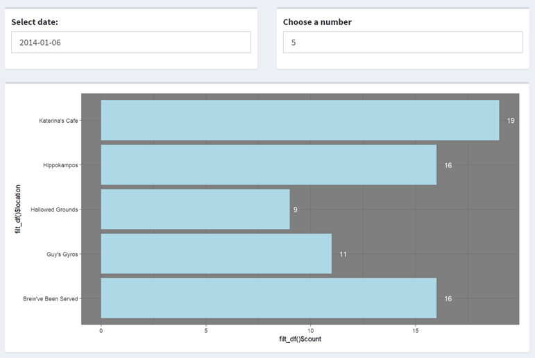

Besides that, by comparing the Top 10 popular locations on different dates, it is clear that the popular location categories are different on weekdays and on weekends. On weekdays, the most popular locations are almost restaurants and coffee shops. However, there are more public places and shops on the weekends.  For, example, on 12rd January, Albert’s Fine Clothing and Desafio Golf Course are also on the Top 10 list.

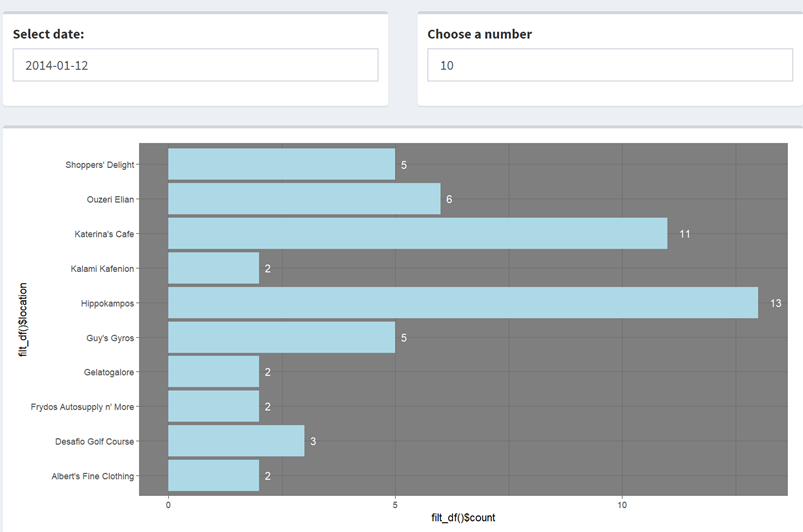

However, on the 6th January, the shop Frydos Autosupply n’More is one of the most popular locations. We can pay more attention on this shop in the following analysis.

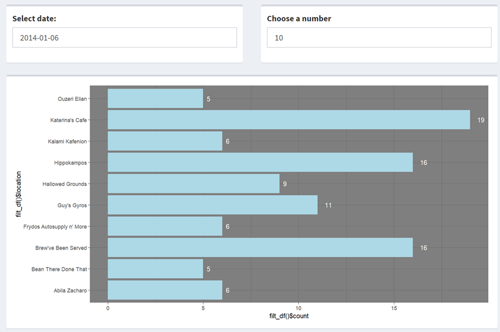

## Geospatial Map Visualization

### Line Graph

graph, we can draw any car’s roadmap on any day, which also reflects the car owner’s daily activities. Once we find any suspect ID, the roadmap can help to show the trajectory of the vehicle and verify the suspect.

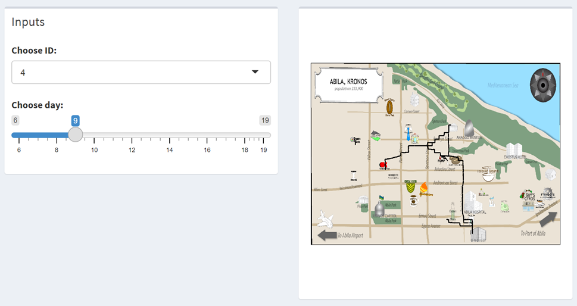

### Dot Graph

Even though the roadmap can give us a general picture of employees’ daily routes, such lines on the map cannot help to show the visiting places. Therefore, in order to create relationship between credit card records and gps information, we need to find out the parking time and the driving time associated with each transaction. Here a new variable “Time Difference” is created to calculate the time interval. If the car is moving, the gps data is collected every three seconds. The gps information during movement is actually not useful for the location verification. So, we assume that the minimum parking time interval is 3 minutes. Then only those data whose time intervals are longer than 180 seconds are retained. In this way, the trajectory of the vehicle is not line anymore, but boarding point instead.
We can try on this interactive graph to find out the ownerships of credit cards.

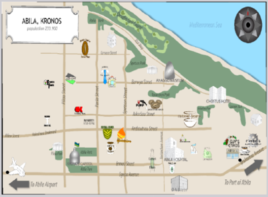

# Demonstration

Overall, for this shiny app, we achieve two main visualization and can realize 4 types of interactive information tracking.

The shiny app can be used to find the most popular place. Once you input the data and run all the steps of app, you can find which location people often go to. You can choose the date, and choose how many places you want to know (top_n).

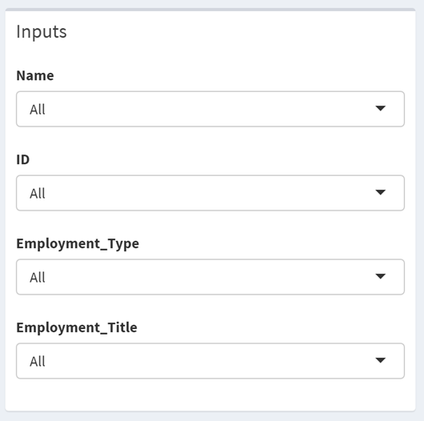

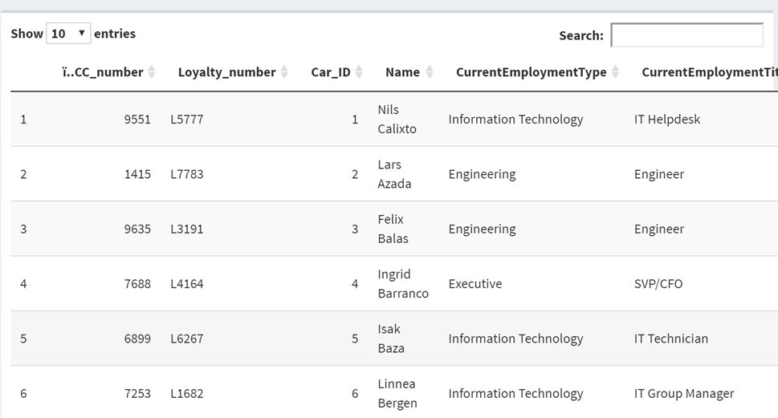

4. The shiny app of geospatial map visualization can be used for finding people’s track. Just like trace together, once we input the date, as well as the ID, we can easily see the routes of this ID. Combining gps data and the purchase data, we can find the daily habbit and his/her preference routes. This can be useful when we need to find the anomalies. 
Here are some anomalies analyses.
When compare the transaction records and gps information, we found that some vehicles were in the same geographical location at the same time. Such institution can be regarded as suspicious ones and to draw their movement track to explore their relationship.
The first suspicious pair we find is card ID 33 and 7. The line graph and dot graph are drawn below. The two visited the Chostus Hotel several time at 13pm and visited restaurants at evening. And they even have some tracks in the same apartment. The owners of the cars are Elsa Orilla and Brand Tempestad separately. And they have the same employment type and employment title.
In the following graphs, the purple color represents the ID 33 and the light-yellow color represents ID 7.

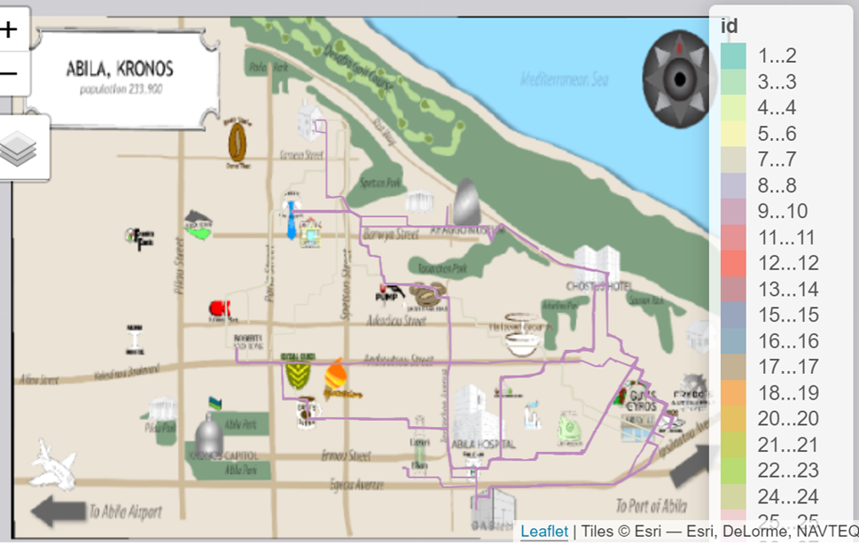

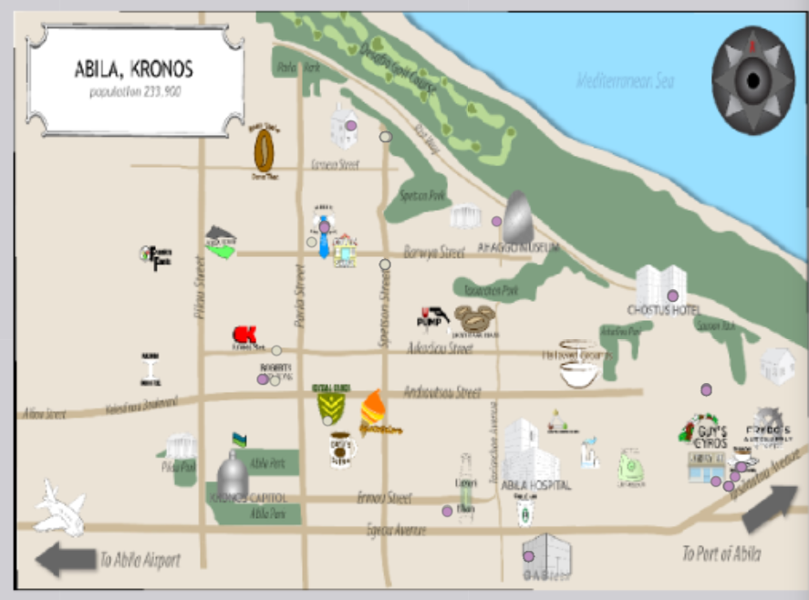

The second suspect group are Car ID 22, 30 and 15. There is a lot of overlap in the tracks of these cars. They often buy coffee in Brew’ve been Served and often have lunch in the nearby restaurants. The owners of the three cars are Nubarron Adra, Loreto Bodrogi and Felix Resumir. These three employees are all security guards. Therefore, we can assume that they have comparably close relationship.
In the following graphs, the blue color represents ID 15, the green color represents ID 22 and the pink color represents the ID 30.

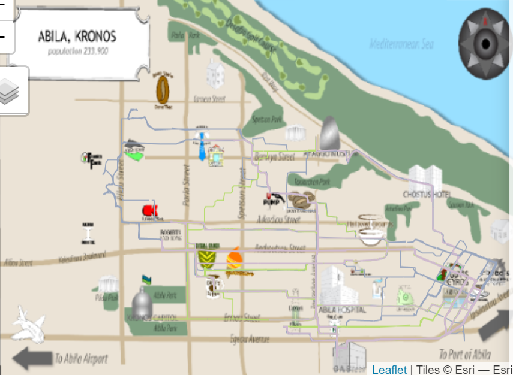

We draw dot plot at 2am, 3am, 4am, and 5am when generally very few people are outside. 15, 21, 24 and 16 are suspicious car id. There are several people gathering in the Frydo’s Autosupply N More. Someone even drive to parks far from the downtown center. Therefore, there are some suspicious activity locations: Spetson Park, Taxiarchon Park and Frydo’s Autosupply N More.

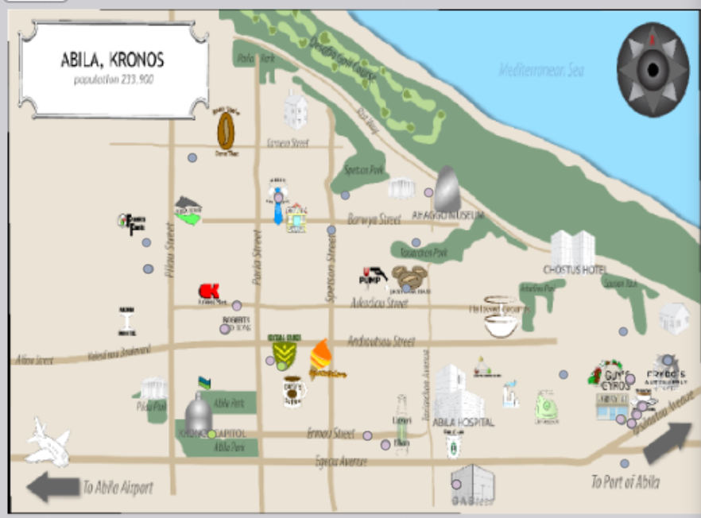

# Discussion

Audience can find how to combine traditional plotting methods with geospatial visualization methods. The creative part of our application is that we can give interactive experience of visualization. We provide user many options to select and filter the data table as well as plots and maps. 

# Future Work

There are some improvements we can make for better performance. First, there are some visualizations that might be suitable for static but not too good to show in the shiny as well as interactive way, such as heatmap. Therefore, we may need to add some static visualizations to help us analyze in the future work. Moreover, we can find more data, such as email or text messages to better defining the relationship between employees. Since the linkages of credit cards and loyalty cards may be not very accurate to define the relationship between employees. Some text data will be helpful to find the relationship and the social networks.

# References

| 1. [CERTH_ITI-Stavrop-MC2](http://vast.cs.umass.edu/VAST%20Challenge%202014/challenges/MC2%20-%20Patterns%20of%20Life%20Analysis/entries/CERTH-ITI/)
|   http://vast.cs.umass.edu/VAST%20Challenge%202014/challenges/MC2%20-%20Patterns%20of%20Life%20Analysis/entries/CERTH-ITI/

| 2. [Making Interactive Plots Using Shiny in R](https://uoftcoders.github.io/studyGroup/lessons/r/shiny/lesson/)
|   https://uoftcoders.github.io/studyGroup/lessons/r/shiny/lesson/

| 3. [Patterns-at-GAStech](https://github.com/z-yuchen97/Patterns-at-GAStech/tree/master/pictures)
|   https://github.com/z-yuchen97/Patterns-at-GAStech/tree/master/pictures

| 4. [Shinydashboard Examples](https://rstudio.github.io/shinydashboard/examples.html)
|   https://rstudio.github.io/shinydashboard/examples.html

| 5. [Tutorial: A Journey from Basic Prototype to Production](https://appsilon.com/journey-from-basic-prototype-to-production-ready-shiny-dashboard/)
|   https://appsilon.com/journey-from-basic-prototype-to-production-ready-shiny-dashboard/

| 6. [Xiaoru_VisualizationOverview](http://vis.pku.edu.cn/vissummerschool16/2016_07_14_Xiaoru_VisualizationOverview.pdf)
|   http://vis.pku.edu.cn/vissummerschool16/2016_07_14_Xiaoru_VisualizationOverview.pdf

