This shiny application contains mainly two parts, Exploratory Data Analysis(EDA) and Geospatial Mapping Visualization(GMV). Here is the overview of the panel.

After you open the link of application, click the bar in the red frame to show the tabs.

It appears two tabs, which corresponds to two main functions. 

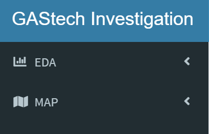

# 1. EDA

Use this tab to do exploratory data analysis.

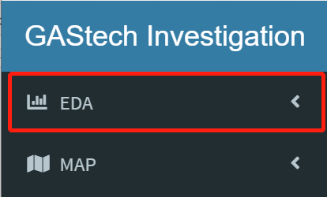

Click the white triangle to find sub tabs.

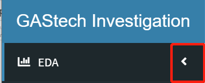

### 1.1 Ridge Plot

1) Click *Ridge Plot* in the red box. 

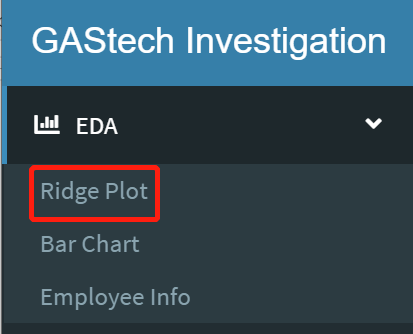

2) At the right side of the tab, there are two inputs for user to select. 

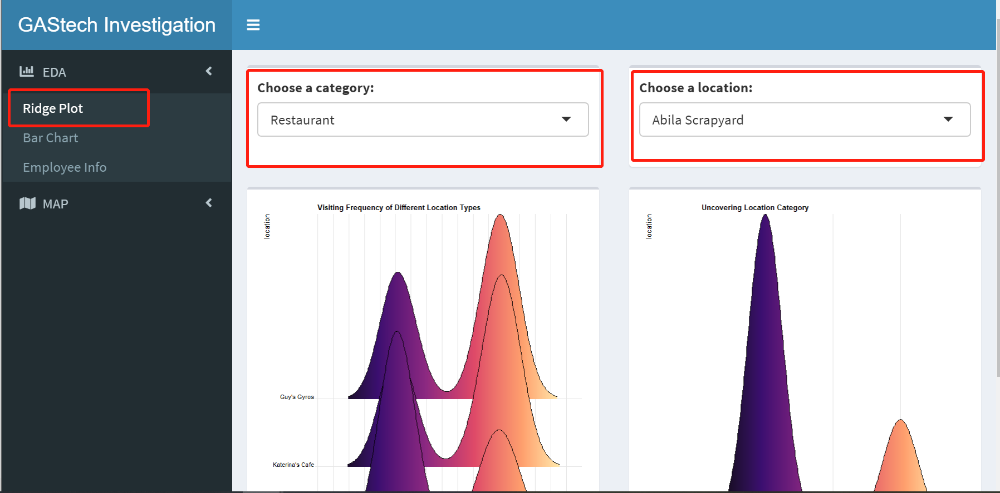

3) Click the black triangle to show the choices.

4) User can select a general category of location on the left side or choose a specific location on the right side.

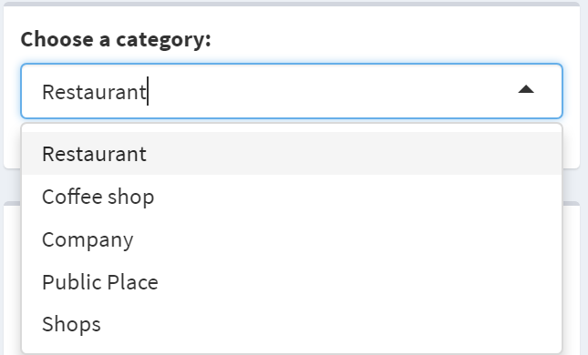

### 1.2 Bar Plot

1) Click *Bar Plot* in the red box. 

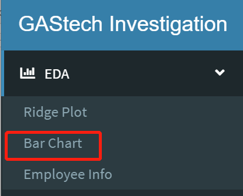

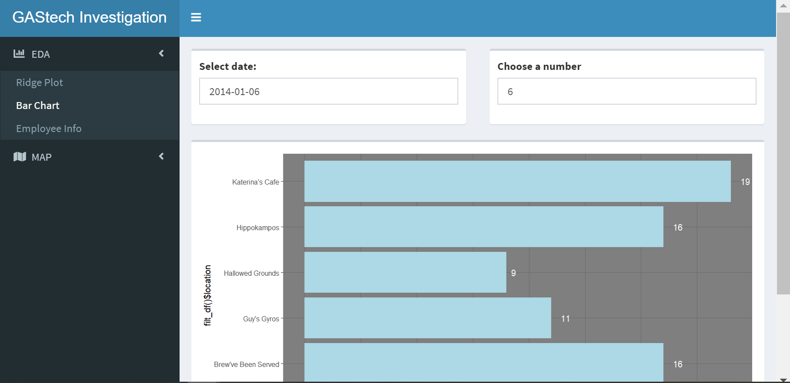

2) At the top, there are tow blanks(in red boxes) for user to input the date and number of top popular locations.

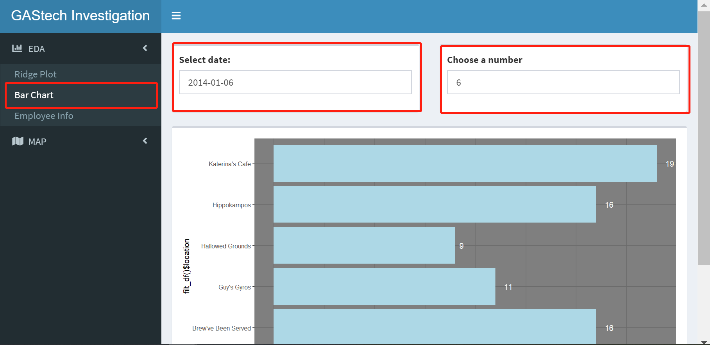

3) Click in the *Select date:* blank to select date. 

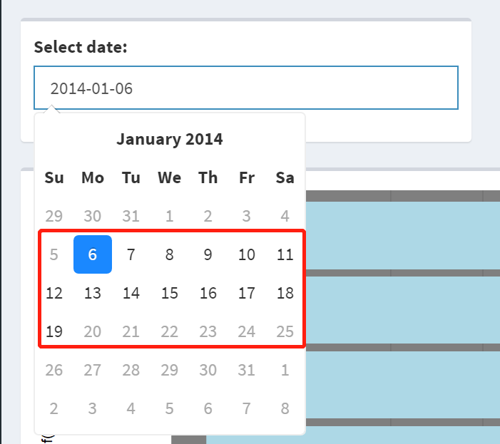

4) Click in the *Choose a number* blank. User can use up-down triangle to adjust the number of bars to shown in the bar plot.

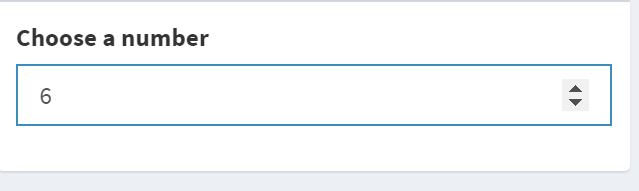

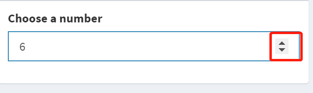

### 1.3 Employee Info

1) Click *Employee Info* in the red box. 

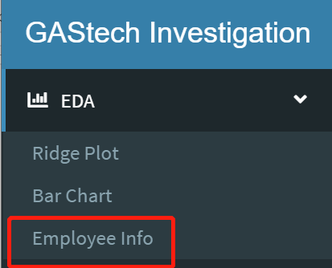

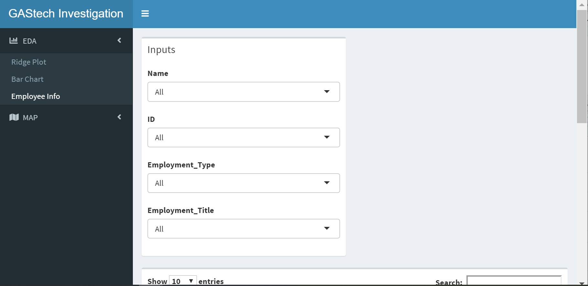

2) At the input sidebar, there are four panel for user to filter.

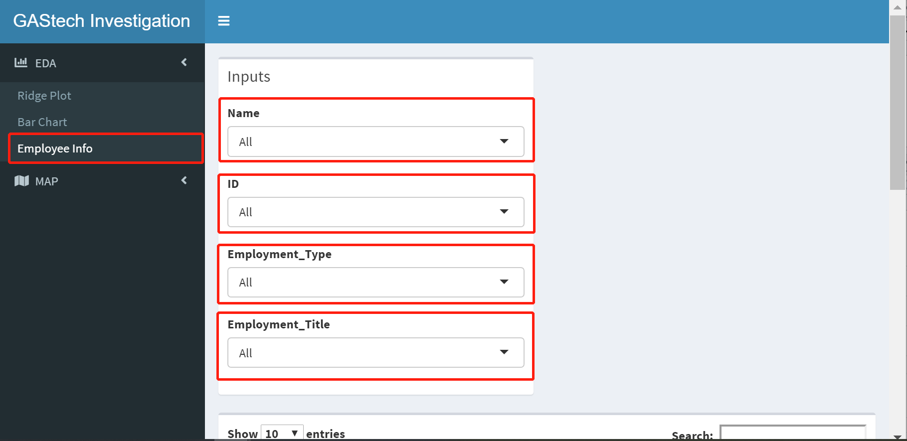

3) For each panel, click the black triangle(highlighted in red box) to show the whole choices. User can decide to choose name, ID, Employee Type or Employee Title to do the filtering.

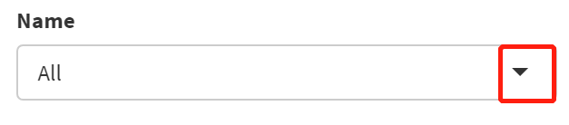
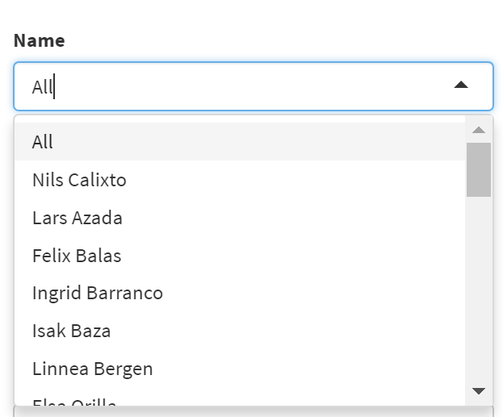
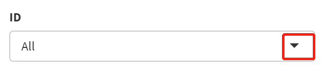
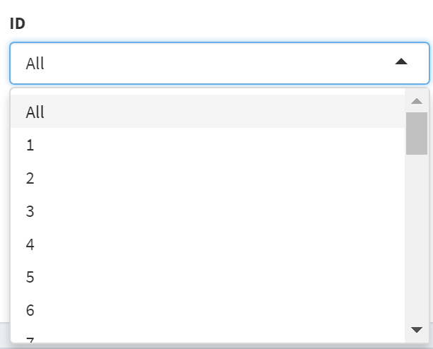
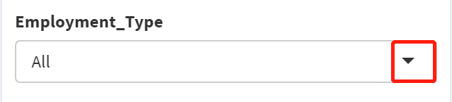
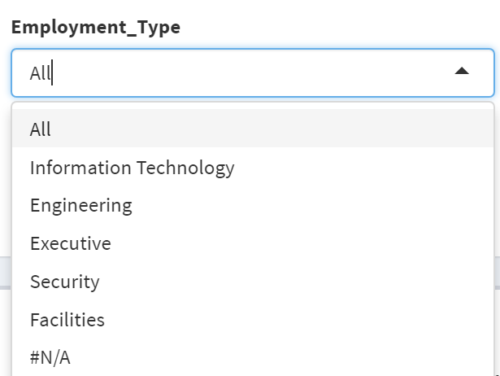
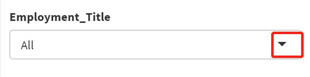
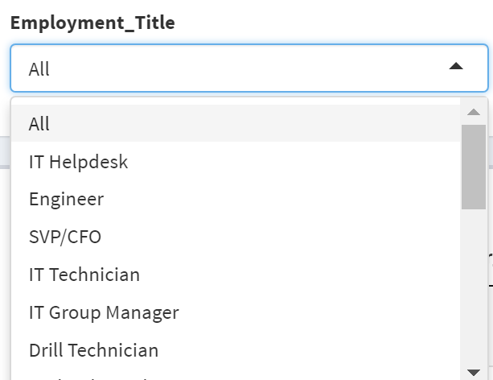

# 2. GMV

Use this tab to do Geospatial Mapping Visualization.

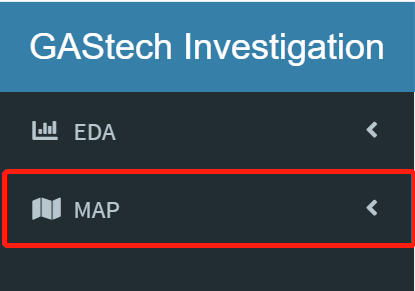

Click the white triangle to find sub tabs.

### 2.1 Line Plot

1) Click *Line Plot* in the red box. 

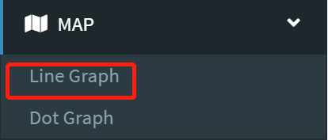

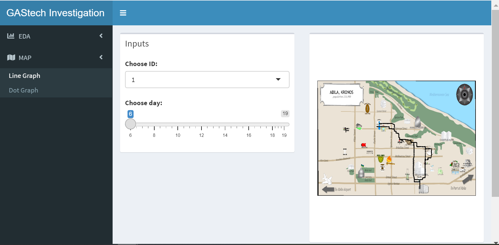

2) There are two features for user to select. 

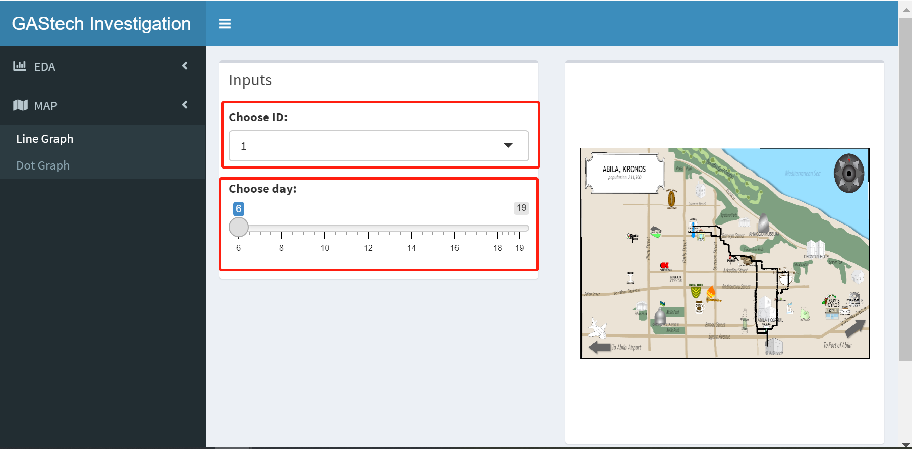

3) Click the black triangle to choose the ID.

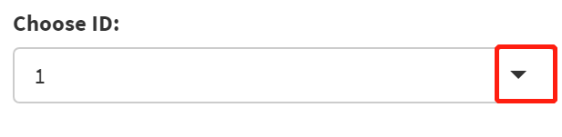

4) User can use mouse th drag the white dot to filter time.

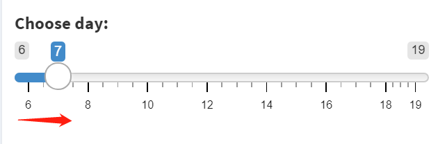

### 2.2 Dot Plot

1) Click *Dot Plot* in the red box.

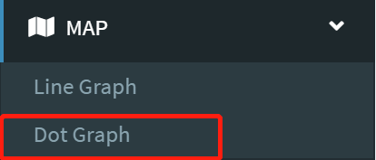

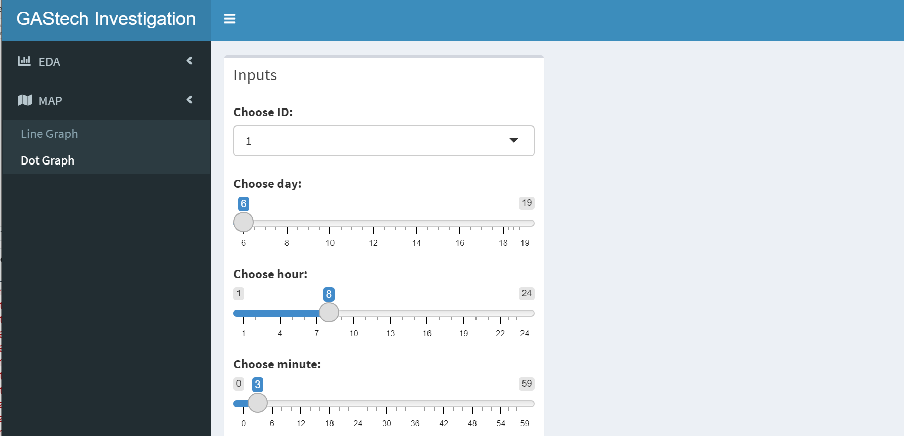

Drag down the website to see the plot.

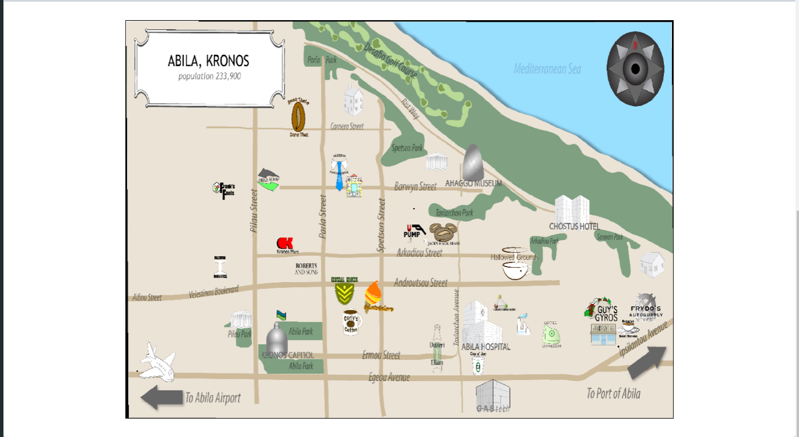

2) There are four features for user to select. 

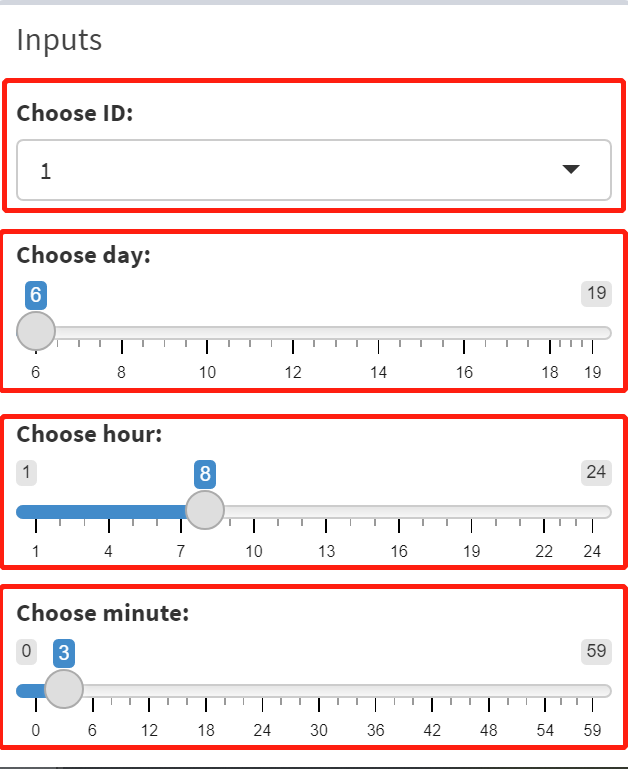

3) Click the black triangle to choose the ID.

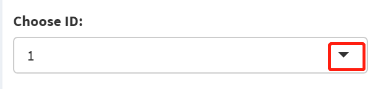

4) User can use mouse th drag the white circle to filter time.

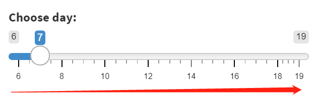

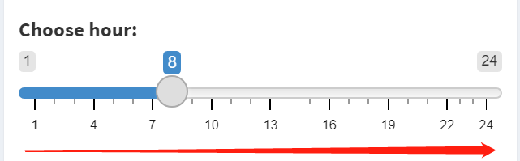

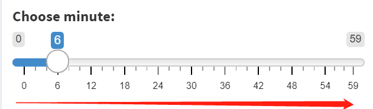

